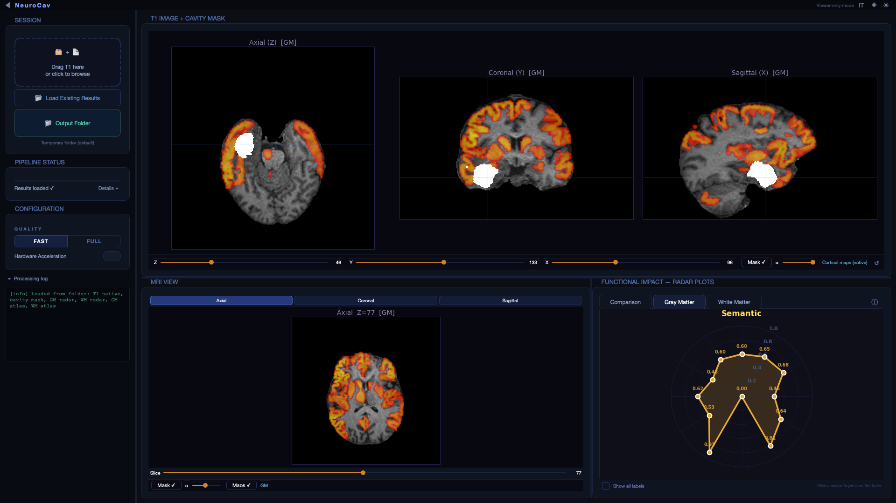
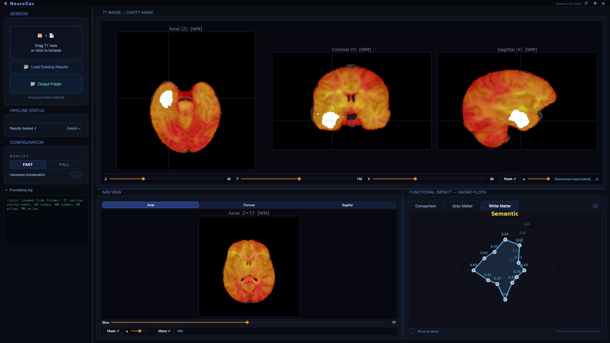

# Neucav: Deep Learning Tool for Post-Surgery Cavity Mask Generation

**Version:** 1.0.0.1  
**Author:** aspolverato  
**Email:** aspolverato@fbk.eu  
**Affiliation:** NILab (CIMeC and FBK)

## Overview

Neucav is a comprehensive deep learning tool designed to automatically generate post-surgery cavity masks from post-operative T1-weighted contrast-enhanced (T1-w-CE) MRI images. The tool leverages state-of-the-art neural networks (nnUNet) and provides detailed analysis including overlap calculations with anatomical regions of interest (ROIs).

## Features

- **Multi-format Input Support**: Accepts NIfTI files (.nii, .nii.gz), DICOM folders, or ZIP archives containing DICOM files
- **Automated Preprocessing Pipeline**: Includes DICOM conversion, resampling, reorientation, skull stripping, and MNI registration
- **Quality Control Options**: Two quality levels (0: low/fast, 1: high/slow) for different use cases
- **ROI Analysis**: Calculates overlap with white matter and gray matter regions of interest
- **Visualization**: Generates radar plots for anatomical importance analysis
- **Flexible Output**: Supports both NIfTI and DICOM output formats
  
## GUI

## Processing Pipeline

The tool executes the following automated pipeline:

1. **Input Validation and Format Detection**
   - Detects file format (NIfTI, DICOM folder, or ZIP)
   - Extracts ZIP archives if needed

2. **DICOM to NIfTI Conversion** (if applicable)
   - Converts DICOM files to NIfTI format using dcm2niix
   - Handles multiple series and selects appropriate T1-w images

3. **Image Preprocessing**
   - **Resampling**: Converts to isotropic 1×1×1mm resolution
   - **Reorientation**: Standardizes to RAS (Right-Anterior-Superior) orientation
   - **Skull Stripping**: Removes non-brain tissue using SynthStrip
   - **MNI Registration**: Registers to MNI152 standard space using FLIRT

4. **Neural Network Prediction**
   - Applies pre-trained nnUNet model (Dataset 950) for cavity segmentation
   - Uses 3D full-resolution configuration with custom training

5. **Post-processing**
   - Transforms predicted mask back to original image space
   - Restores original orientation and resolution
   - Ensures geometric consistency with input image

6. **ROI Analysis**
   - Calculates overlap with white matter tracts
   - Computes overlap with gray matter regions
   - Generates importance scores for different anatomical areas

7. **Visualization and Output**
   - Creates radar plots showing anatomical importance
   - Packages final results in standardized format

## Output Files

The tool generates a comprehensive set of outputs in the specified directory:

### Main Outputs
- **`res_cavity.nii.gz`**: Final cavity mask in native image space
- **`res_cavity_MNI.nii.gz`**: Cavity mask in MNI standard space
- **`flirt_to_mni.mat`**: Affine transformation matrix to MNI space

### Analysis Results
- **`GM_importance.csv`**: Gray matter region overlap analysis
- **`WM_importance.csv`**: White matter tract overlap analysis
- **Radar plots**: Visual representation of anatomical importance (PNG/PDF/SVG)

### Intermediate Files (for debugging/quality control)
- Resampled, reoriented, and skull-stripped images
- Registration matrices and intermediate transformations
- Volume statistics and processing logs

## Quality Control

The tool includes several quality control measures:

- **Volume Validation**: Checks if predicted mask has non-zero volume
- **Geometric Consistency**: Ensures proper alignment between mask and original image
- **Processing Logs**: Detailed logging of each processing step
- **Intermediate File Preservation**: Allows inspection of processing pipeline

## Troubleshooting

### Common Issues

1. **Empty mask warning**: If the predicted mask has zero volume, check:
   - Input image quality and contrast
   - Presence of actual surgical cavity
   - Image orientation and preprocessing success

2. **Memory issues**: For large images:
   - Use quality level 0 for reduced memory usage
   - Ensure sufficient system RAM
   - Consider processing on a machine with more resources

3. **Registration failures**: If MNI registration fails:
   - Check FSL installation and FSLDIR environment variable
   - Verify input image has proper brain anatomy
   - Ensure skull stripping was successful

### Log Files
Check the console output for detailed processing information and error messages. The tool provides verbose logging for each processing step.

## Citation

If you use Neucav in your research, please cite the appropriate publications related to the underlying methods (nnUNet, FSL, ANTs, FreeSurfer).

## License

Please refer to the individual software licenses for the components used (nnUNet, FSL, ANTs, FreeSurfer).

## Support

For issues, questions, or contributions, please contact:
- **Author**: aspolverato
- **Email**: aspolverato@fbk.eu
- **Affiliation**: NILab (CIMeC and FBK)

## Version History

- **v1.0.0.1**: Initial release with full pipeline implementation
